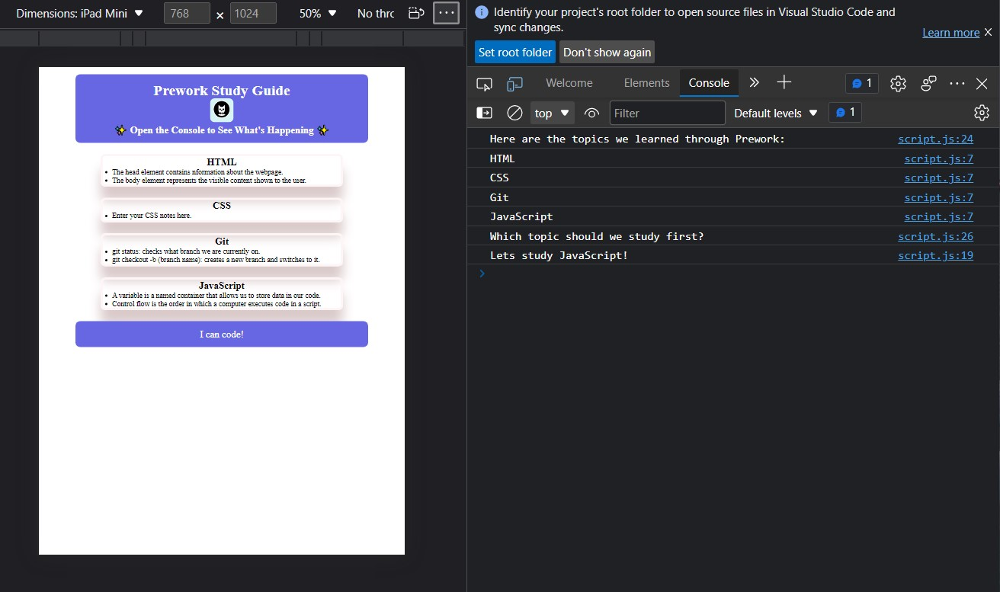

# Prework Study Guide Webpage

## This webpage will act as 'aide memoire' and workflow tool for the duration of the course.

This webpage has been constructed as part of the prework required for qualification for the bootcamp course.
This webpage will assist in recording progress through the course and will also act as a reference source for those awkward moments when memory fails.
The very process of constructing this page has been a great learning tool. Having to access Github frequently, has reinforced previous learning and led to a clearer understanding of its use.

## Installation N/A

## Usage

Each section of the webpage contains notes on the subjects that have been included in the course (HTML, CSS, JavaScript, Git).
To acess the functionality of the site; open Dev Tools > console, and you will see the JavaScript running. It will not only list the topics learned thus far but will pick a topic for us to explore.

## Credits N/A

## License

MIT License 
[MIT Licence](LICENCE)
The last section of a high-quality README file is the license. This lets other developers know what they can and cannot do with your project. If you need help choosing a license, refer to [https://choosealicense.com/](https://choosealicense.com/).

---

🏆 The previous sections are the bare minimum, and your project will ultimately determine the content of this document. You might also want to consider adding the following sections.

## Badges

